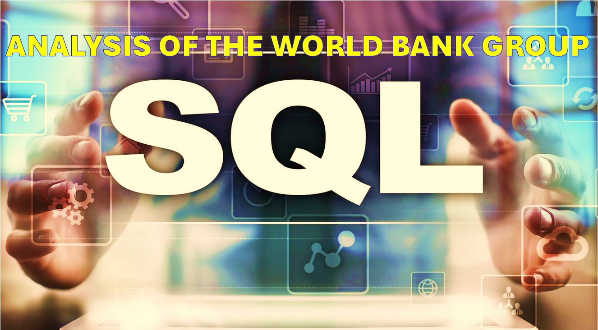

### 

---

# Welcome to My Portfolio

---
## *Mirosoft Excel Projects*

---
#### [Food Delivery Consumer Project](https://www.linkedin.com/pulse/ifood-things-consider-growth-customer-retention-shane-williams-yaq9c/)

Being a consumer that has used a similar delivery service for products, I was interested to see what insights I could find about shopper vs marketing.  I was surprised by a few things I found from the data and others were exactly what I expected. 

---
## *Tableau Projects*

---
#### [Education Project (Dashboard)](https://public.tableau.com/app/profile/shane.williams8245/vizzes)
#### [Education Project (LinkeIn Writeup)](https://www.linkedin.com/pulse/review-insights-massachusetts-education-system-shane-williams-mmtzc/)

In this case study from Data Analytics Accelerator, I was prompted to analyze the State of Massachusetts education data.

The main focuses were:

What are the school's graduating percentages?

How does class size affect college admission?

Which are the school districts % of passing 4th grade math, and which schools are higher than 50%?

---
## *SQL Projects*

---
#### [SQL Analysis of the World Bank]()

I focused this project on the Republic of Yemen and their COVID-19 project loans. 

---

---

### Category Name 2

- [Project 1 Title](http://example.com/)
- [Project 2 Title](http://example.com/)
- [Project 3 Title](http://example.com/)
- [Project 4 Title](http://example.com/)
- [Project 5 Title](http://example.com/)

---

